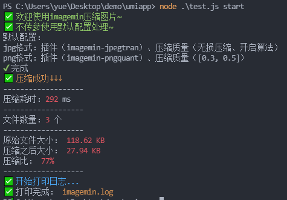
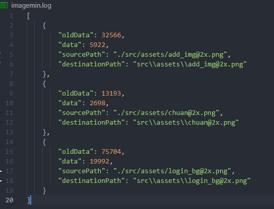

<div align="center">
  
  
  <h1>image-minify-cli</h1>
  <P>
    <a href="https://github.com/JS-banana/image-minify-cli/stargazers" target="_black">
      
    </a>
    <a href="https://www.npmjs.com/package/image-minify-cli" target="_black">
      
    </a>
    <a href="https://www.npmjs.com/package/image-minify-cli" target="_black">
      
    </a>
     <a href="https://github.com/JS-banana" target="_black">
      
    </a
  </p>
</div>

<!-- # image-minify-cli -->

## ✨ 描述

`image-minify-cli`是为解决项目使用时手动压缩图片的繁琐操作，通过`cli`命令一键压缩。

建议在发布前执行一次即可，压缩完成后会在当前目录下生成日志`imagemin.log`方便查看。

<!--  -->

<!--  -->

## 📦 安装

```shell
pnpm add -D image-minify-cli
# or
yarn add image-minify-cli -D
# or
npm install image-minify-cli -D
```

## 🚀 使用

- ***默认配置***：

  - 支持图片格式：`.{jpg,JPG,jpeg,JPEG,png}`
  - jpg压缩插件：`imagemin-jpegtran`
  - png压缩插件：`imagemin-pngquant`
  - 文件入口：当前目录下的 `./src/assets`
  - 文件出口：同入口（压缩完成后直接替换源文件）

- ***主要代码***

  ```js
  async (input, output) => {
    const result = await imagemin(input, {
      destination: output,
      plugins: [
        imageminJpegtran({
          progressive: true, // 开启无损压缩
          arithmetic: true, // 开启算法
        }),
        imageminPngquant({
          // speed: 10,
          quality: [0.3, 0.5], // 压缩质量
        }),
      ],
    })
    return result
  }
  ```

一.***以插件形式使用***

1. 根目录下创建 `imagemin.js` 文件

    ```js
    require("image-minify-cli")
    ```

2. 执行脚本

    `node imagemin.js start`

二.***命令行使用***

*该功能需要全局安装，推荐先使用第一种方式*

> 查看版本：`imagemin -v`
>
> 开始压缩：`imagemin start`

```shell
pnpm add image-minify-cli -g
# or
yarn global add image-minify-cli
# or
npm install image-minify-cli -g
```

## ✅ Todo

- [ ] 自定义配置
- [ ] 命令行动态传参
